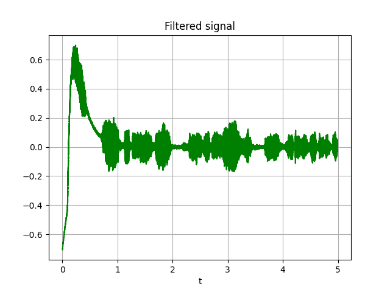

# Python Frequency Selective Filter

Work of digital signals signal processing from Computer Engineering course from UFRN.

## Issue

> Especifique e projete por função janela de Kaiser um sistema que filtre de uma amostra de seu sinal de voz x[n], com duração de 5 segundos, um sinal de ruído propositadamente adicionado ao sinal de voz, e representado por n(t) = An cos(2π2000t), em que An apresenta um valor elevado. Mostre os gráficos do sinal de voz original x[n], corrompido pelo ruído x[n] + n[n], e filtrado y[n], em ambos os domínios: tempo e frequência. Também apresente a resposta ao impulso e a resposta em frequência do filtro projetado.


## Requirements

- pyhon-audio: `sudo apt-get install portaudio19-dev python-pyaudio python3-pyaudio`
- [pipenv](https://pypi.org/project/pipenv/)

## Usage

Type the following commands:

```bash
pipenv shell
pipenv install
python main.py [OPTIONS]
```

## Options

Option | Type | Default | Description
------ | ---- | ------- | -------
-d | int | 5 | Recording duration in seconds
-r | int | 44100 | Audio sample rate
-w | enum | kaiser | Filter window type
-wc1  | int | 1900 | The cutoff frequency 1 of the filter
-wc2 | int | 2100 | The cutoff frequency 2 of the filter
-rd | int | 60 | The desired attenuation in the stop band, in dB
-n1 | int | 1950 | Noise minimum frequency
-n2 | int | 2050 | Noise maximum frequency
-p | bool | True | Play audios with and without noise


## Results

- `python main.py --duration 5 --cutoffhz1 1800 --cutoffhz2 2200 --noise_1 1950 --noise_2 2050`


